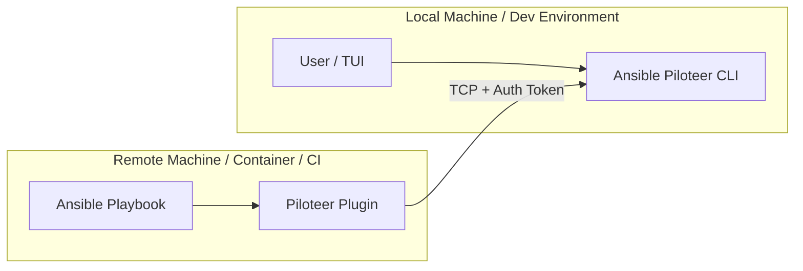

# Distributed Mode Guide

Ansible Piloteer supports **Distributed Mode**, allowing you to decouple the User Interface (Controller) from the Ansible execution environment (Executor). This is useful when:

-   Running Ansible inside a container or VM while debugging from your host machine.
-   Managing execution on a remote jump host.
-   Collaborating on a shared debugging session.

## Architecture

In Distributed Mode, the Piloteer CLI acts as a TCP server, and the Ansible Plugin connects to it as a TCP client.



## Setup Instructions

### 1. Start the Controller (Piloteer CLI)

On the machine where you want to view the TUI (e.g., your laptop):

```bash
# Listen on all interfaces on port 9000
# Set a shared secret for security
./target/release/ansible-piloteer run --bind 0.0.0.0:9000 --secret my_super_secret_token
```

You should see:
> IpcServer listening on TCP 0.0.0.0:9000
> Waiting for Ansible connection...

### 2. Configure the Executor (Ansible Environment)

On the machine where Ansible runs:

**Requirements:**
-   Piloteer Plugin installed (ensure `ansible_plugin/` is present).
-   Ansible configured to use the plugin.

**Environment Variables:**

```bash
# 1. Point to the plugin
export ANSIBLE_STRATEGY_PLUGINS=/path/to/ansible-piloteer/ansible_plugin/strategies

# 2. Enable the strategy
export ANSIBLE_STRATEGY=piloteer

# 3. Configure Connection to Controller
#    Replace with Controller's IP Address
export PILOTEER_SOCKET=192.168.1.50:9000

# 4. Set the Shared Secret
export PILOTEER_SECRET=my_super_secret_token
```

### 3. Run the Playbook

Run your playbook as normal on the Executor:

```bash
ansible-playbook my_playbook.yml
```

The execution logs and interactive prompts will immediately appear on the Controller's TUI.

## Security Considerations

-   **Transport**: The current implementation uses raw TCP. For public networks, it is recommended to tunnel this connection (e.g., via SSH or VPN) or wait for future TLS support.
-   **Authentication**: The `--secret` / `PILOTEER_SECRET` mechanism ensures that only authorized Ansible processes can send data to your debugger.
